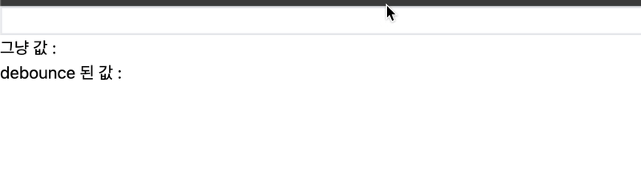
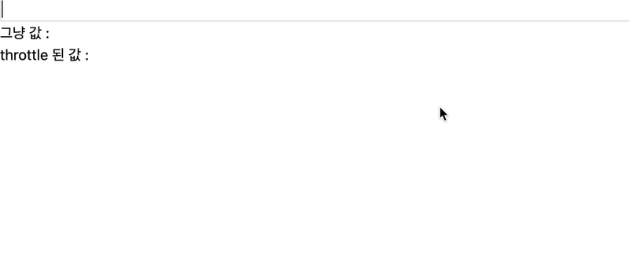

# 목차

이 폴더에는 다양한 커스텀 훅들이 포함되어 있습니다. 각 훅의 기능은 다음과 같습니다:

1. [useDebounce](#usedebounce)
1. [useDebounceCallback](#usedebouncecallback)
1. [useThrottle](#usethrottle)
1. [useThrottleCallback](#usethrottlecallback)
1. [useScreenOn](#usescreenon)

## `useDebounce`

이 훅은 주어진 값이 변경된 후 일정 시간(delay)이 지나기 전까지 업데이트를 지연시킵니다. 주로 입력 필드와 같은 경우에 사용하여 사용자가 입력을 멈춘 후에만 값이 업데이트되도록 할 수 있습니다.

사용법:

```ts
const debouncedValue = useDebounce(value, delay);
```

### 사용화면



## `useDebounceCallback`

이 훅은 주어진 콜백 함수의 호출을 지연시킵니다. 주로 이벤트 핸들러와 같은 경우에 사용하여 사용자가 연속적으로 이벤트를 발생시킬 때 마지막 이벤트만 처리되도록 할 수 있습니다.

사용법:

```ts
const debouncedCallback = useDebounceCallback(callback, delay, deps);
```

## `useThrottle`

이 훅은 주어진 값이 일정 시간(limit) 내에 한 번만 업데이트되도록 합니다. 주로 스크롤 이벤트와 같은 경우에 사용하여 성능을 최적화할 수 있습니다.

사용법:

```ts
const throttledValue = useThrottle(value, limit);
```

### 사용화면



## `useThrottleCallback`

이 훅은 주어진 콜백 함수의 호출을 일정 시간(limit) 내에 한 번만 허용합니다. 주로 이벤트 핸들러와 같은 경우에 사용하여 성능을 최적화할 수 있습니다.

사용법:

```ts
const throttledCallback = useThrottleCallback(callback, limit, deps);
```

## `useScreenOn`

isOnScreen, targetRef 를 반환하고 targetRef에 감지된 요소가 화면에 노출될때 isOnScreen 변수가 true로 변경됩니다.

해당 훅으로 화면에 노출되어있는 요소인지 아닌지 판별 가능합니다.

disconnect, connect 함수로 계속 observing 할지 말지 변경 가능합니다.

### 사용법

```tsx
const { isOnScreen, targetRef, disconnect, connect } = useScreenOn();

<div ref={targetRef}>target</div>;
```

### 사용화면


